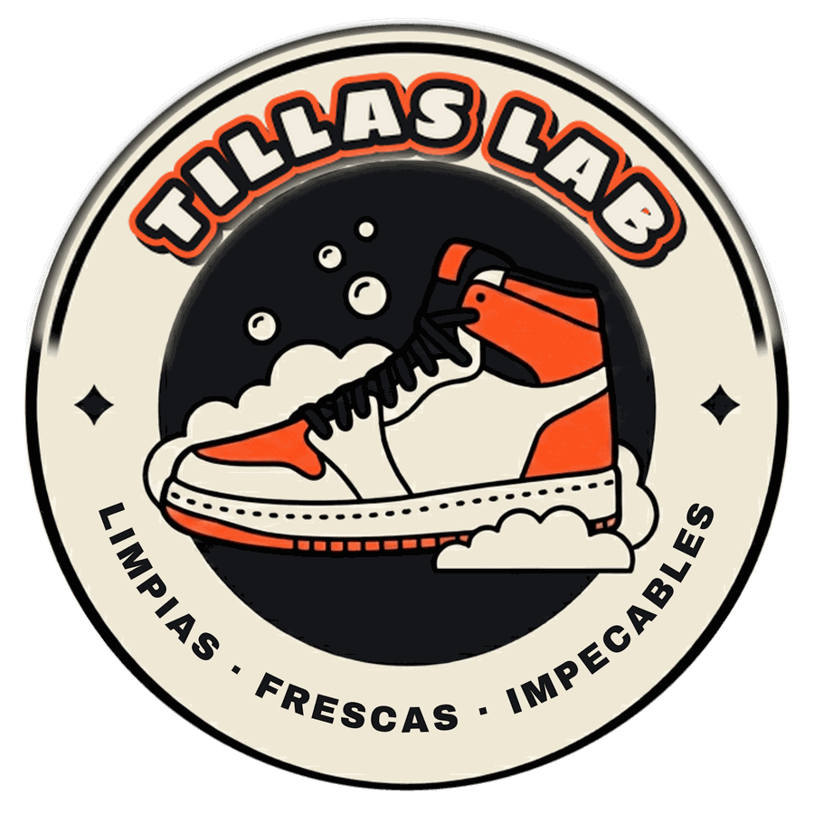

# Tillas Lab · Sistema de diseño

Fuente de verdad del aspecto de la web. Los colores viven en `tema.css` y en
ningún otro lado: si tocás uno ahí, cambia en las cuatro páginas.

La paleta y las tipografías no se deciden acá. Salen del sello de marca, que
está especificado en `Logo/Tillas-Lab-Logo/MARCA.md`. Este documento explica
cómo se aplican a la interfaz.

Última actualización: 16 de agosto de 2026.

---

## 0. Un solo tema

Hasta el 15 de agosto el sitio tenía tres pieles intercambiables (`comun`,
`street` y `grafity`) con una barra selectora, para que el dueño eligiera sin
frenar el desarrollo. **El dueño eligió `street`.**

El 16 de agosto se aplanó todo a un solo tema: la piel `street` repintada con
los valores exactos del sello. Ya no hay `data-modo`, ni barra selectora, ni
bloques alternativos. Lo que quedó es el tema definitivo.

Carácter: muro y afiche. Fondo de papel crema, naranja aerosol como único
acento, esquinas rectas, títulos en negra alta y sombras duras corridas.

---

## 1. Identidad

- **Marca:** Tillas Lab
- **Bajada:** Limpias. Frescas. Impecables.
- **Promesa:** *Vos usalas. Nosotros las dejamos impecables.*
- **Diferencial:** retiro y entrega a domicilio. El cliente no se mueve de su casa.
- **Zona:** Gran San Miguel de Tucumán, Argentina.
- **Canal:** WhatsApp. La web es la vidriera, el chat es la caja.

**Tono de voz.** Segunda persona del singular, voseo rioplatense. Frases cortas,
afirmativas, sin signos de exclamación ni emojis. Habla de zapas, no de calzado.
Promete plazos concretos y no adjetiva de más.

---

## 2. Color

Tres colores. Los tres salen del sello y no hay un cuarto.

| Rol | HEX | Variable | Dónde |
|---|---|---|---|
| Crema | `#F2ECE1` | `--crema` | Fondo de la página, relleno de las letras del logo |
| Tinta | `#131417` | `--tinta` | Texto, contornos, superficies fuertes |
| Naranja | `#FF5A2D` | `--naranja` | Único color de acento |

### 2.1 Superficies, de la más honda a la más alta

```css
--bg:     #F2ECE1;  /* fondo de la página */
--paper:  #FAF7F0;  /* hoja de sección */
--card:   #FFFFFF;  /* tarjeta */
--band:   #EDE6D9;  /* superficie elevada, íconos */
--strong: #131417;  /* proceso, cierre y pie */
```

### 2.2 Texto

```css
--ink:            #131417;  /* principal */
--soft:           #5C5648;  /* secundario */
--faint:          #8B8579;  /* terciario, metadatos */
--on-strong:      #F2ECE1;  /* sobre superficie tinta */
--on-strong-soft: #C9C4B8;
```

### 2.3 Bordes

```css
--hairline:   #E3DCCD;
--hairline-2: #CFC7B5;
```

### 2.4 Acento

```css
--accent:      #FF5A2D;   /* relleno, bordes, y texto sobre tinta */
--on-accent:   #131417;   /* lo que va encima del naranja */
--accent-ink:  #CC2C00;   /* el naranja, pero como texto sobre fondo claro */
--accent-soft: rgba(255,90,45,.16);
--wa:          #1da851;   /* verde WhatsApp */
```

**Por qué hay dos naranjas.** El naranja de marca sobre el crema da 2.65 de
contraste y es ilegible como texto. `--accent-ink` es el mismo tono y la misma
saturación, bajado de luminosidad hasta pasar AA: 4.55 sobre crema y 5.35 sobre
blanco. **Se usa solo para texto sobre fondo claro. Nunca para relleno ni para
bordes**, donde el naranja de marca va pleno. Sobre tinta el naranja pleno da
5.92 y no hace falta cambiarlo.

Por lo mismo, lo que va encima del naranja es tinta y no blanco: blanco sobre
naranja da 3.11 y no pasa AA para texto de botón.

**Regla del naranja.** Es el único acento. Se usa en el botón principal, los
tildes de las listas, el subrayado del menú activo, el polígono del mapa, los
rótulos manuscritos y el contorno exterior del logo. Nada más. Si aparece un
segundo color de acento, está mal.

**Regla del verde WhatsApp.** Si algo es `--wa`, se toca y abre WhatsApp. Nunca
decorativo.

**Ya no existen** el volt `#b6e534`, el cian `#2ee6d6` ni el aerosol `#ff4d17`.
Si aparece alguno en el código, es residuo y hay que sacarlo.

---

## 3. Tipografía

| Fuente | Uso |
|---|---|
| **Archivo** (variable, `wdth 62..125`, `wght 100..900`) | Cuerpo, botones, formularios |
| **Archivo Black** | Títulos, siempre en mayúscula. Es la fuente del arco inferior del sello |
| **Sigmar One** | Solo el logo y los números del proceso. Es la fuente del arco superior del sello |


**Son tres y no hay una cuarta.** Hasta el 16 de agosto los rótulos, la bajada y
los apuntes iban en Kaushan Script, una manuscrita heredada del diseño anterior
que no figura en MARCA.md. Se sacó. Todo eso pasó a Archivo Black en mayúscula
con interletrado abierto, que es la volanta del afiche y la fuente del arco
inferior del sello.

```css
--font:       "Archivo", system-ui, sans-serif;
--font-title: "Archivo Black", "Archivo", system-ui, sans-serif;
--font-logo:  "Sigmar One", cursive;
```

Pesos: 400 cuerpo, 600 énfasis, 800 botón principal. **Los títulos van en 400**:
Archivo Black trae un solo peso y pedirle 700 lo deforma donde el navegador lo
simula.

**Sigmar One la eligió el dueño** el 16 de agosto, sobre las nueve opciones de
`Logo/comparativa-tipografias.png`. Queda cerrada. Igual está centralizada en
`--font-logo`: si alguna vez cambia, es una línea acá y otra en el `<link>` de
Google Fonts.

Las cuatro son de Google Fonts, licencia SIL Open Font, uso comercial permitido.

---

## 4. El logo

El logo es un **sello redondo**: anillo crema, disco tinta, zapatilla, arco
superior "TILLAS LAB" y arco inferior "LIMPIAS · FRESCAS · IMPECABLES". La
geometría completa está en `MARCA.md` y no se improvisa.

**Hay una sola marca: el sello.** No existe una versión alternativa del wordmark.

**Donde entra completo** va como imagen:

```html

```

Va en el hero, en el favicon, en el `og:image` y en las fotos de perfil.

**Donde no entra** —la barra superior y el pie, que tienen 60 px de alto— va el
lockup horizontal: el sello chico más la palabra al lado.

```html
<a class="lk lk-sm" href="#top" aria-label="Tillas Lab">
  
  <span class="palabra">Tillas Lab</span>
</a>
```

**La palabra no imita el arco del sello.** Va en Sigmar One, tinta plena, recta
y sin contornos ni sombras. Acompaña al sello, no compite con él.

Esto es importante y se hizo mal una vez: hasta el 16 de agosto la barra tenía
un lockup de texto que copiaba el tratamiento del arco —relleno crema, contorno
tinta, contorno naranja— pero en línea recta. Se parecía lo suficiente al sello
como para que el ojo esperara que fueran iguales, y se diferenciaba lo
suficiente como para leerse como un error. Si alguna vez hace falta el wordmark
solo, va plano.

Sobre superficie tinta la palabra pasa a crema. Está resuelto por contexto
(`footer`, `.proto`, `.cta-final`, `.topbar-app`); si el contenedor declara el
fondo en línea, hay que marcarlo con `.sobre-tinta`.

Escalas: `lk-sm` barra y pie (sello 38 px, palabra 19 px), `lk-md` ficha del
pedido (sello 52 px, palabra 26 px).

### 4.1 Archivos en `marca/`

| Archivo | Para qué sirve |
|---|---|
| `logo.png` | Sello 900 px, fondo transparente. El que usa la web |
| `logo-sobre-crema.png` | El mismo, aplanado sobre `#F2ECE1` |
| `logo-redondo.png` | Sello 800 px transparente, para material suelto |
| `lockup-sobre-blanco.png` | Sello sobre blanco puro, para imprenta y terceros |
| `avatar.png` | 512 px. Foto de perfil de Instagram y Facebook |
| `perfil-180.png` | 180 px. Favicon, apple-touch-icon y WhatsApp Business |
| `portada.png` | 820 × 312. Portada de Facebook |
| `og.png` | 1200 × 630. Imagen al compartir la web |
| `sello-80.png` | Sello 80 px, para el lockup de la barra y el pie |
| `sello-120.png` | Sello 120 px, para el lockup de la ficha |
| `sello-maestro.png` | El sello a 1600 px. De acá se regenera todo lo demás |
| `logo.svg` | **Desactualizado**: su arco sigue en Luckiest Guy. Ver `marca/LEEME-svg.txt` |

Todos están cuantizados a 256 colores: el sello tiene pocos colores planos y
así pesa una décima parte sin diferencia visible. El original de 3000 px vive
en `Logo/Tillas-Lab-Logo/Logo/` y de ahí se regenera todo.

**Estado del sello.** Los PNG están compuestos: el arco superior en Sigmar One
viene de la lámina de comparación, que es de menor resolución que el resto. En
pantalla no se nota. Para imprenta conviene regenerar el sello completo: los
pasos están en `marca/LEEME-svg.txt`.

**Limitación del SVG.** El texto son curvas vectoriales de verdad, pero la
zapatilla sigue siendo un mapa de bits incrustado, y además el arco quedó en la
tipografía anterior. **No sirve para vinilo de corte ni para bordado.** Para eso
hay que vectorizar la zapatilla o encargarle el dibujo a un ilustrador.

---

## 5. La ficha antes/después

Es una tarjeta blanca sobre el crema de la página, y por eso funciona: se lee
como una ficha de taller real apoyada sobre el mostrador.

```css
background:var(--card); border:1px solid var(--hairline); color:var(--ink);
```

Adentro va el SVG de zapatilla, dibujado una sola vez como `<symbol id="shoe">`
y pintado por capas con variables CSS. El estado *después* pone `--sh-scuff`,
`--sh-stain` y `--sh-bg` en `transparent` y sube todo a blancos; el estado
*antes* usa marrones sucios.

Capas: `--sh-bg`, `--sh-up`, `--sh-mid`, `--sh-out`, `--sh-collar`,
`--sh-tongue`, `--sh-eyestay`, `--sh-lace`, `--sh-lace-line`, `--sh-cap`,
`--sh-heel`, `--sh-flash`, `--sh-line`, `--sh-open`, `--sh-shadow`,
`--sh-scuff`, `--sh-stain`.

---

## 6. Componentes

| Clase | Uso |
|---|---|
| `.btn-dark` / `.btn-acento` | Acción principal. Naranja, contorno tinta 2 px y sombra dura `3px 3px 0` |
| `.btn-wa` | WhatsApp. Verde pleno |
| `.btn-ghost` | Terciaria. Solo borde, pasa a naranja al pasar el mouse |
| `.card` | Tarjeta de servicio. `.featured` suma borde naranja |
| `.card .pop` | Etiqueta destacada, manuscrita sobre naranja, rotada −2° |
| `.lbl` | Volanta de sección. Archivo Black, mayúscula, `.16em`, en `--accent-ink` |
| `.tagline` | "Limpias. Frescas. Impecables." Archivo Black, mayúscula, `.2em` |
| `.proto` | Bloque de proceso. Superficie tinta con rasante |
| `.sheet` | Hoja de sección, esquinas rectas |
| `.sello` | El logo como imagen. `.sello-xl` hero, `.sello-sm` chico |
| `.promos` | Grilla de dos cupones de apertura. Con `.una` queda a una columna centrada |
| `.promo` | El cupón. `.destacada` lo bordea en naranja, `.agotandose` enciende el contador |
| `.promo .cifra` | El número grande, en Sigmar One con el tratamiento del logo |

**El bloque de promos.** Es un afiche con dos cupones lado a lado. La cifra (10
y 50) va en Sigmar One con el mismo tratamiento que el logo —relleno crema,
contorno tinta, contorno naranja— y es lo que ata el bloque a la marca. La
primera promo es el gancho y lleva `.destacada`; la segunda va en gris.

El script decide qué se ve: antes de abrir se anuncian las dos juntas, ya
abiertos va una sola y se encadena a medida que se agotan; agotadas las dos,
aparece `.promo-siempre`. Los cupos se bajan a mano en el bloque `PROMOS` del
script de `index.html`. Con 3 o menos, el contador se pone naranja solo.

Dentro de los cupones el botón de WhatsApp lleva sombra tinta y no naranja: el
verde con sombra naranja sobre fondo oscuro ensuciaba los tres colores.

**El logo de WhatsApp va pintado.** Es un graffiti de bloque: relleno `#25d366`,
contorno de 8 px en tinta, sombra dura corrida de 9 px y un reflejo en `#84f2b0`.
Se dibuja una sola vez como `<symbol id="wa-pintado">` y se usa con
`<use href="#wa-pintado">` en los seis lugares donde aparece. Nunca el ícono
plano de 24×24. Necesita más caja que un ícono corriente para que el trazo se
lea: `1.85em` en los botones, `1.95em` en la barra, 26 px en el pie y 72 px en
el flotante.

---

## 7. Movimiento

Todo entra **cuando ya está a la vista**, nunca antes. La clase `.reveal` sube
24 px y desenfoca 8 px, con retraso escalonado por `--d`. El disparo está al
86% del alto de pantalla en escritorio y al 70% en celular.

Hay tres respaldos porque hay webviews donde `IntersectionObserver` no entrega
callbacks: observador, evento de scroll y un sondeo cada 600 ms.

Todo se apaga con `prefers-reduced-motion`.

---

## 8. Layout

```css
--pad-x: 44px;  /* escritorio */
--pad-x: 36px;  /* ≤900px */
--pad-x: 26px;  /* ≤640px */
--radius: 0px;  /* esquinas rectas en todo el sitio */
```

Riel de 1272 px para las hojas, 1080 px para el contenido. Breakpoints: 1300,
900, 640 y 600 px.

**Esquinas rectas en todo**, incluidos los chips del mapa, los controles de zoom
de Leaflet y las etiquetas del antes/después. Las únicas curvas son los puntos
(`border-radius:50%`) y el anillo de foco.

---

## 8 bis. El mapa de cobertura

Leaflet con tiles de CARTO, capa **`light_nolabels`**. Sin etiquetas a propósito:
los nombres de las ocho localidades los pone la página con sus propios chips, y
la capa con etiquetas los duplicaba encima del mapa.

- Polígono de la zona: contorno naranja de 3 px, relleno al 16%.
- Marcadores: relleno crema con contorno tinta de 3 px. En naranja competían con
  el polígono, que ya es naranja.
- Chips (`.zl-tip`): fondo tinta, texto crema, Archivo Black en mayúscula, rectos.
- Controles de zoom: rectos, con borde tinta de 2 px.

Hasta el 16 de agosto la capa era `dark_all`, heredada del tema grafity. Sobre el
crema quedaba como una caja negra en el medio de la página.

---

## 9. Reglas al generar

1. **Un solo acento.** Naranja `#FF5A2D`. Si aparece un segundo color, está mal.
2. **Títulos en mayúscula**, en Archivo Black, peso 400.
3. **Sin exclamaciones ni emojis.**
4. **El antes/después es el formato estrella.**
5. **Mobile primero.** El público llega por Instagram en el teléfono.
6. **Aire entre secciones.** El dueño pidió "limpio y ordenado, con aire".
7. **Los colores se tocan solo en `tema.css`.** Nunca un hex suelto en el HTML.
8. **Naranja como texto sobre claro va en `--accent-ink`.** Sobre tinta, naranja
   pleno. Confundirlos rompe el contraste.

---

## 10. Pendientes

Nada de esto se puede inventar. Depende del dueño:

- **Número real de WhatsApp.** Hoy hay 10 apariciones de `5493810000000`
  repartidas en las cuatro páginas. Es lo que impide difundir la web.
- **Dirección del local.** La promo de los 10 pares gratis dice "solo en el
  local" y no hay local que nombrar.
- **Fotos reales** de pares lavados, con la misma luz, fondo y ángulo en el
  antes y el después.
- **Lámpara UV.** Ya está publicada como paso 4 del proceso, sin confirmar que
  esté comprada y operativa.
- **Gamuza y cuero.** El FAQ dice que se trabajan aparte, pero al eliminar el
  plan Premium se quedaron sin precio ni plazo propio.
